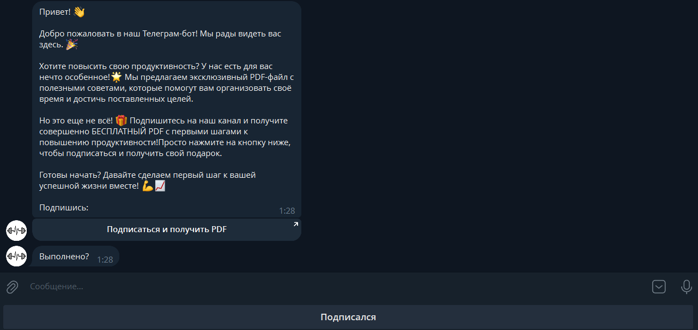
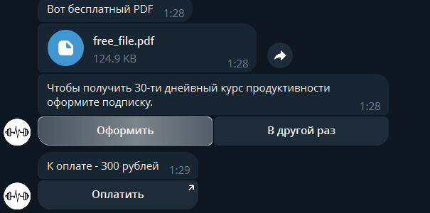
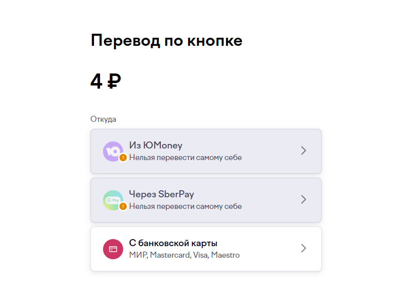
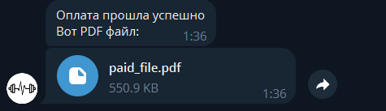
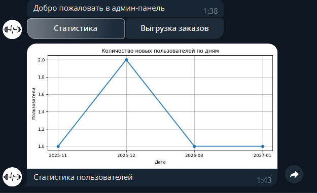

# Aiogram Telegram Bot - бот по выдаче PDF-файла с подпиской

Телеграм бот по выдаче сначала бесплатного файла при условии подписки на определнный телеграм канал, затем если пользователь захочет - выдача платного файла с оформлением подписки через Юмани.

## Описание проекта

Бот работает в режиме polling. Имеется админ панель со статистикой и выгрузкой из БД

## Технологический стек

- [Python](https://www.python.org/)
- [Aiogram 3](https://docs.aiogram.dev/en/dev-3.x/)
- [SQLite3](https://www.sqlite.org/)
- [YooMoney](https://yoomoney.ru/main)

## Реализованные функции

- Добавление пользователя в БД-SQLite3 на старте
- Проверка подписки пользователя на телеграм-канал
- Оформление подписки через Юмани
- Проверка подписки (в течение часа, затем ссылка удаляется)
- Выдача бесплатного и платного PDF-файла
- Администрирование возможно только определенным пользователям по команде /admin, которые внесены в БД

### Администрирование

- Просмотр статистики пользователей - сколько человек оплатило подписку и в какое время
- Выгрузка подписанных пользователей в отдельный Excel файл

### Клиентская часть

- Получение бесплатного файла при подписке на телеграм канал
- Получение платного файла при оплате подписки

## Фото интерфейса
### Клиентская сторона

-

-

-

### Админская сторона

-

-
